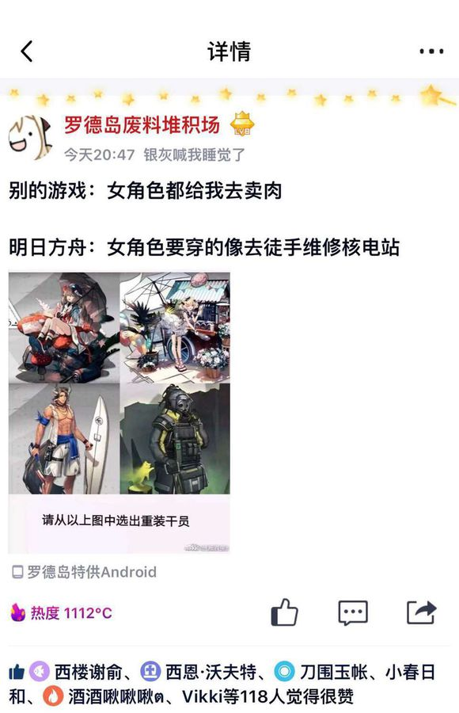

在耶路撒冷有人问，同样是刷梗，ky，骑脸，为啥其他游戏的卫兵没zwb这么人人喊打？

答案：zwb的程度，广度和频率完全不同  
广度好理解，打击范围甚至蔓延到av（指animal video）和单机  
频率好理解，看次数就知道了  
那这个程度如何解释？图中就是个很明显的例子

所谓二次元gacha手游，游戏性有高有低，氪金度各不相同，甚至性取向都五花八门，但不变的是，每个游戏都是玩家跑过来舔纸片老公/老婆/女儿/儿子（等下这个好像没有）的，而且玩家花费的都是真金白银。也因此，大部分gacha论坛里，直接攻击角色的行为都是红线。你可以说画风不喜，性格不喜，甚至画师画的太差了，但是你要是敢直接去辱骂某个角色表字/渣南，立马会被其他人群起而攻之。哪怕你是官方，写出来的剧情去恶意抹黑某个角色，那也是会被玩家炎上的，会被飞🐎的，会被逼着出来道歉的。

结果zwb呢？不但直接攻击了，还直接把所有角色拉一起A了。搞清楚啊，再怎么自嘲窑子，那也是自嘲。而且这个自嘲的窑子实际上全员都是玩家后宫，是玩家独占的老婆/老公，哪允许外来的流氓口花花肆无忌惮的？？

