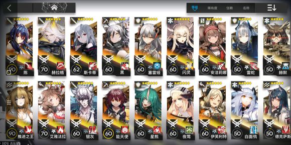

练度可能看起来没啥特别突出的，但是我专三了14个技能，也能说明我对这游戏其实投入了挺多，为啥会被玩同一个游戏的大多数人恶心到，我来详细一个个列出来并分析出现这些现象或者问题的原因

1.最早的海豹骑脸：其实海豹骑脸的情况大多手游圈子都有，也是各手游圈子都特别抵制的一种行为。其实大多数双修或者多修的玩家还有点数，主要在舟游开服热度挺高的，有些确实舟游确实是他们二次元入坑作，没点b数的使劲晒，这也是为啥舟游会被捧得特别高的原因，这批玩家大部分没啥见识，也看不到舟游的问题，只懂得跟着喊口号

这个现象还和游戏本身设计也有关系，我也不能断言这算缺点还是优点。舟游干员的潜能提升真的不大，干员本身发光点只在他的技能和天赋上，海豹们抽到1潜的实际和你歪到满潜的没啥区别，这让海豹们骑脸晒你的时候让你感觉更加恶心，即便他出的干员你歪满潜了。

2.值班干员：在开服刚过一个月左右，舟游圈疯狂的值班干员的风气有多恶心相信反吧老哥里玩过舟游的都知道。这个时候饭圈文化已经慢慢开始露头了，值班的人大多使用踩一捧一的手法，什么斯卡蒂不如梅兰沙实惠，夜莺不如5星奶，推王卡手不如红豆，黑不如普狗等等等等，反过来还有一边吹干员一边黑其他干员，比如银灰输出高还是aoe，蒂蒂做得到？洁哥小火山也就用个乐，真要输出还得用小绵羊等等

事后诸葛亮一下，现在舟卫兵们大搞饭圈文化，踩一捧一，其实自游戏开服值班干员哪会就有了苗头。这也是开服热度高的必然后果，毕竟人多热度高，玩家讨论激烈没有办法。但是锅还是要有人背的，一是各个社区的管理，都没有对这种现象进行管理，二是鹰角自己在干员设计上确实屎的一坨，第五章甚至做出了人权关卡这种不伦不类的东西来提升节奏较多的干员地位，以及开服放出的6星现在依然是大多人心中的战力天花板，很难让人否认干员设计在一开始他们根本没怎么下功夫

3，理解厂商：这是我最恶心也最不能接受的。舟卫兵们整天拿YJ是刚起步，要我这个玩家理解他生产力慢，理解长草。这个我先不说，因为一开始我也没在意，而且我很早养成目标达成，游戏乐趣少了很多，长草当个仓鼠玩家也不是不行。最恶心的在于舟卫兵们已经丧心病狂到不让你对游戏提意见，我也是第一次理解了什么叫🦅孝子

事情起因是这样的，国庆活动有复刻骑兵活动限时出售的皮肤，当时我们群里很多开服玩家和满级大佬都表示有点不爽，我也是其中之一，毕竟其他手游限定皮肤极少见过这么快又拿出来卖的。当时聊的有点上火，我就去另一个方舟群里说了下这件事，看看其他人是什么意见，然后他们就给我扣优越党的帽子，说皮肤不是限定的不能秀所以不爽了？觉得复刻有问题你就别买啊，觉得游戏运营有问题你就别玩啊，各种言论

有一说一，我的box已经放在楼上，我能晒得有很多，一起玩的人比我能氪能肝的更多，能秀的很多，皮肤对我们来说真没什么好秀的，我们也不屑去秀几个皮肤，不爽只是来源于活动限时出售，一边肝活动一边氪新池，还要一边挤出来买皮肤，因为我们从开服玩的号，尽量不让自己错过些东西也是很正常，我们甚至觉得，想照顾后来的玩家，不如不搞限时出售我们还会好过点

而且我们说的话，也不算是在喷鹰角，只能说是对运营操作发表意见，然而就这样，舟卫兵还是GC了。先是给你扣上找优越感的帽子，然后劝你退游。
海猫:当然意见我们还是会听取的

4.舟卫兵的各种送🐴行为:其实我玩的手游不多，我自己承认我也是我口中的玩过的手游不多没啥见识的人。不过我觉得我还是知道该做啥不该做啥

去别人展台cos舟游，在少前直播间刷舟游，在各种无关的东西里刷弹幕等等等等，甚至在做了这些事后第一时间看到的只有辩解？个人真的对这种当了婊子还要立牌坊的行为真的觉得恶心。

说到底，他们一直以为自己是个大群体，只要跟着喊口号，自己觉得这些老牌游戏都快过气了，怎么斗得过他们？然而看不到每个月流水的稳步下滑，最近还和YYS干上被人吊着打属实让人觉得又好笑又出气，即便我不是YYS玩家

5.无脑捧爹:这个我说简单点，夏活之前，出小车、角峰皮肤后:“YJ有你的，让那些媚宅警察无话可说”PV出来之后“泳装真好看、啊啊啊啊啊我可以”。正式活动后QQ舟游群多了2个表情：不买闪灵皮肤的请退群以及闪灵NZ的截图

我就纳闷了，吵着方舟不媚宅，皮肤出来还不是漏的最多，NZ最大的闪灵关注度最高？你们所谓的YJ神运营操作的角峰小车有几个人关注？还要说别的手游媚宅？这就像别人在吃饭的时候你非要跑过去说，你吃的是屎啊，然后回头等你爹给你做饭，你爹说，你刚说别人的饭是屎，爹让你和他们吃的一样别人就会说你也吃屎，来，爹在饭上给你盖点真的屎，这样就和他们不一样了，完事舟孝子们还竖起大拇指说，真有你的YJ爹

目前暂时就这样，至于碰瓷其他手游的瓜，一来我自己目前是只玩舟游的，我知道碰瓷行为很恶心人，但我相信就这点其他手游的真爱粉的情绪比我还大，所以我就不说了。二来我说下我自己的立场，我可能很长时间依然会是个舟游玩家，因为我习惯了什么时间玩方舟玩多长时间，而且目前现实有计划不想投入其他坑。我本身也算是我自己前面说的玩的手游不多的人，但我不会跟着舟卫兵搞饭圈那套无脑吹捧。

最后婊一段理中客的言论：你当单机玩别管别人不就行了。

我借用某相声演员的话：那些不明白情况就劝你一定要大度的人，你要离他远一点。因为雷劈他的时候会连累你
