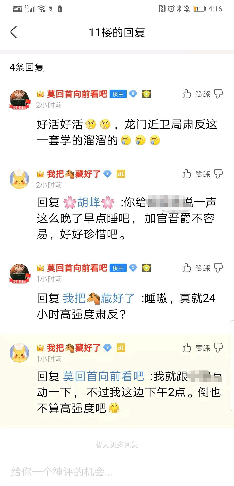
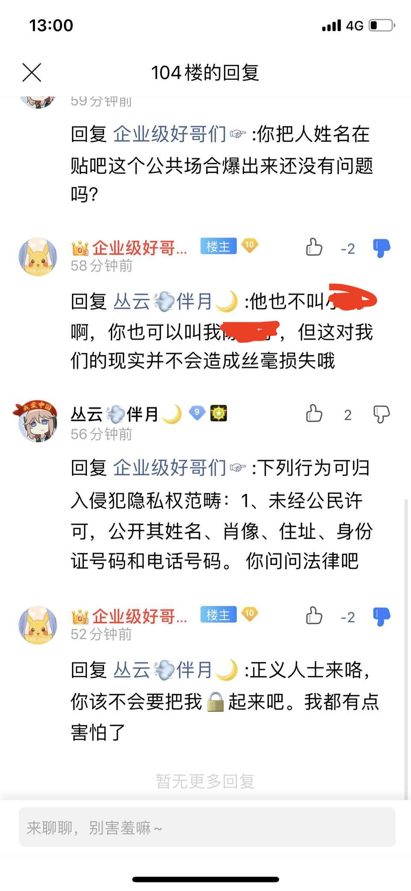
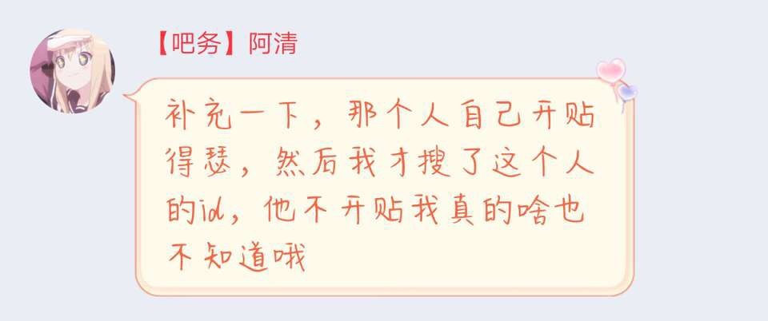
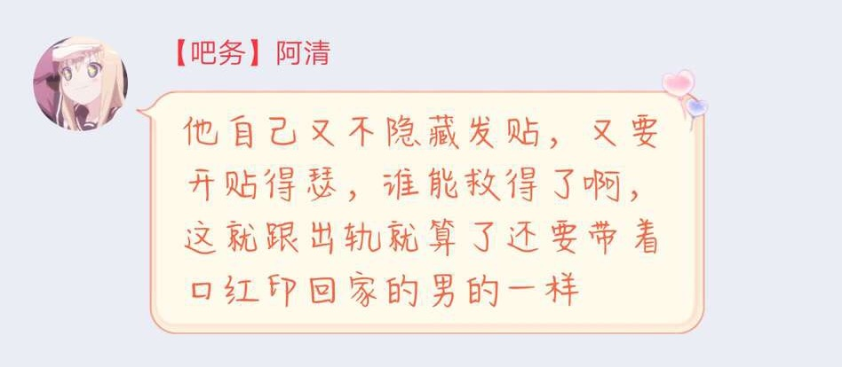
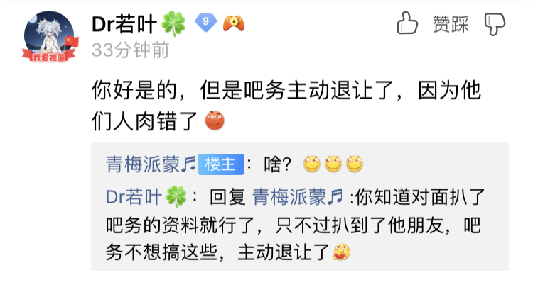
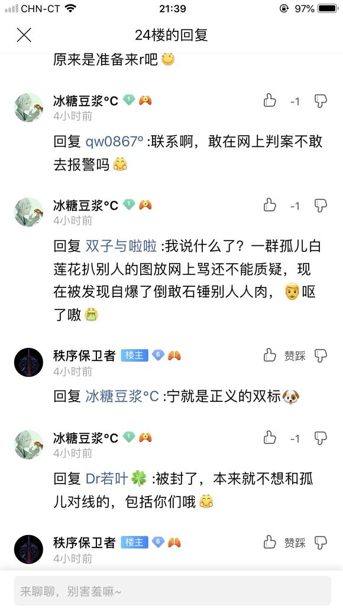

2019年10月12日，反明日方舟吧小吧遭到明日方舟吧“龙门近卫队”（贴吧官方控评q群）人员的人肉。虽然最后人肉到的是那位小吧的朋友，但是这种行为真的可耻、恶心、恶劣至极。

（可能是迫于朋友的压力）小吧最后决定和解，双方删贴，不再追究。可以从碎片还原当时的情景：

## 被《明日方舟》吧小吧主人肉

小吧可以从吧务列表中看到：

该人百度id为：

http://tieba.baidu.com/home/main?un=akaddxiang

已向有关部门举报。

## “你被人肉是你自己不隐藏贴子”

该小吧在qq群里放话，说被人肉是因为他“不隐藏发帖”。

还放话威胁：

## 最后被迫和解

从只言片语中可以看出，人肉是有的，只不过人肉错了。

## 舟卫兵的nc言论

