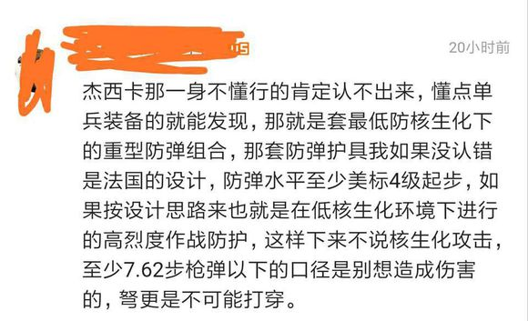
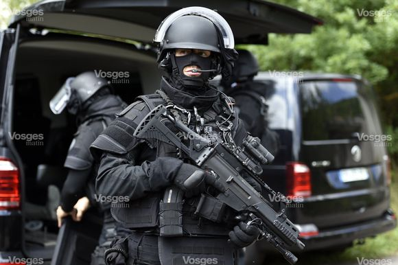

昨晚刷反吧时发现zwb的硬核👮♀️又开始尬吹猫猫头的硬核立绘辽
本想当做神必发言一笑置之的 奈何有人莫名其妙又开始传统艺能踩一捧一 吹的点看起来硬核无比实则也是漏洞百出 咱是实在忍不住想要出来澄清事实 以免广大恰🍉群众真的被唬住辽
1L放神必发言

首先科普一下所谓的美标四级是什么意思。所谓的美标指的是美国国家标准和技术协会（NIST）执法办公室（OLES）制定的一个名为NIJ标准的技术文件。现行的标准是NIJ1010.04。而其中Type IV级也就是常规标准中最高级的防弹标准是能够防住M2重机枪AP弹的命中射击的。而这种防弹性能同样是需要一定的测试标准的。Type IV级的测试武器可以是步枪或.30-06弹药的测试枪膛。建议是使用枪管长度为56厘米(22英寸)的步枪。试验用子弹为.30口径穿甲弹。其公称质量为10.8 g (166 gr)，测量速度为每秒868±15 m(2850±50 ft)

辣么问题来了 米军现役装备序列中单兵防弹效果唯一能达到Type IV级防弹标准的是加了SPAI插板的IOTV。人家是长这样的

而这位神必壬说说的法式防弹护具 我找了半天 和IOTV最为相似的是GIPN（髮国国家警察干预队）采用的护具。暂且不说其是否能达到Type IV级的防弹标准 咱寻思其长得好像和猫猫穿的好像有点不一样啊

至于护具的重量问题咱就忽略不计罢 虽然IOTV＋SPAI的套组全重14kg左右而且还不算上用MOLLE系统装上去的配件的重量 但是毕竟宁泰拉世界人均源石带师 手撕大楼

猫猫头的防弹护具的防弹性能上最为神必的问题在于 她穿的根本就不是类似IOTV的重型作战背心 而是类似于JPC的轻量化作战背心具体实锤可看图。MOLLE系统的挂点是没有护腰的 透过挂点可以直接看见下边的生化防护服 这种取消护腰的设计只有在JPC一类的轻量化作战背心上存在。宁告诉我这叫Type IV级的防弹性能？

关于防弹这一点总结一下。

先单就护具的防弹性能讨论 这一套只加装了护颈护肩和裙摆的轻量化作战背心 其防弹等级是否能够达到那位神必壬所说的Type IV级 这一点是非常值得商榷的

退一万步讲 就算这套护具采用了源石技艺能够刀枪不入 但这套装备的实战效果可能也不及人所想

首先 没有头盔宁给我扯防弹性能？这叫适合高烈度的核生化作战环境？别说是CBRN环境了 就算是在实战环境下 没有头部的防弹护具也几乎等于送死。就算猫猫头的防弹护具能够达到宁所谓的美标四级 咱寻思宁的头骨再怎么也不可能直接抗一发M2的AP弹吧

其次 在CBRN的作战环境下 哪只作战部队不是裹得严严实实的？一般情况下 CBRN环境的作战任务都是靠全副武装的应急处理单位执行的 如米国的DCRF。这种只带个防毒面具的装束只适用于快速通过核生化区的作战行动 高烈度的核生化环境作战就别想了

最后上一张图 结束氵贴

有错误或措辞不当之处还望诸位多多指点

再画蛇添足一下

针对CBRN环境（Chemical, Biological, Radiological & Nuclear 即化学，生物，放射性物质，核武器）的作战需求 各个国家对于其服饰都有相应的技术标准。

冲国的军标有隔绝式防毒衣通用规范GJB2063-94，FFY03型防毒衣规范GJB1971-94和含炭透气防毒服通用规范GJB1750-93等等。米国有针对化学、生物、恐怖事件现场防护服的NFPA1994标准的一类和二类套装 诸位有兴趣的话可以去搜搜看 再来和猫猫头的装备比较一下

总之 即使抛却防弹问题不谈 如果想在核生化环境下作战 你也必须得裹得像图二一样 而显然猫猫头的装备是不够格的

